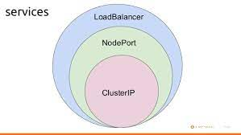
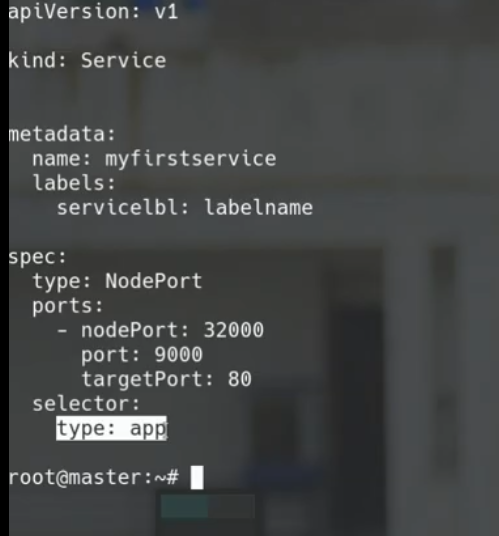

# kubernetics->notes
- we can use sigular /plural or short form command like --
```
kubectl get pod or kubectl get pods or kubectl get po
 ```
 - creating first pod with generator
 ```
 kubectl run pod --generator=run-pod/v1 --image=coolgourav/nginx-custom ---generator wont work deprecated
 kubectl run --image=nginx:alpine myfirstpod -- labels=example=myfirstpod
 ```
 - (kubectl get po -o wide ) for details in which node this pod is running
 ``` 
For yml and json format
 kubectl get po -o yml
 kubectl get po -o json

 ```
 ```
 Suppose you dont know what is pod then you can learn from it
 kubectl explain pods | less
 kubectl explain pod --recursive | less
 ```
 
 ```
 See what is inside a pod or details about pod
 kubectl describe pod nginx | less
 ```
 ```
 Delete a pod either crashloopback or anything
 kubectl delete pod  myfirstpod
 kubectl delete pods --all
 kubectl edit pod podname
 ```
 ```
 watch pod creating
 kubectl get pod -w
 ```
 
 ```
 General form of cmd
 kubectl actionname resource_type resource_name data
 ex:
 kubectl label pod myfirstpod evn1=lool
 Suppose you want to label all pods
 kubectl label pod --all evn1=lool
 ```
 ```
 kubectl get pods --show-labels
 ```
 
 ```
 Run command inside a pod container
 kubectl exec podname env
 If you have multiple container inside your pod
 kubectl exec podname -c container_name
 
 Then go to your bash of your container
 kubectl exec podname -it bash
 But if you have multiple container
 kubectl exec podname -c container_name -it bash
 ```
 
 
 ```
 set command inside a container
 args:['sleep','50']
 ```
 ```
 How to grep name in pod1.yml
 grep name podname.yml
 ```
 ```
 How to make a contaner to listen to any particular port?
 netcat -l -p 8000
 And how to see how many ports is opend?
 netstat -nltp
 ```
 
 ```
 Suppose we have three pod and if we assign a cluster ip then they can communicate with each other but for out side communication we will need node port.Seeing this bellow pictur will give you a clear idea.
 ```
  
   
 ```
 So we are creating service to communicate between nodes
 kubectl expose pod podname --port=8000 --target-port=80 --name myservice
 Here we check this using 
 kubectl get svc/service/services
 and we will see port an ip
 then 
 curl ip:8000
 ```
 
 ```
 Lets talk about node port assign and accesing from out side world
 kubectl expose pod podname --type=NodePort --port=8000 --target-port=80 --name myservice(not worked in minikube)
 ```
 
 ```
 How service work
 In service yml we have and selector.So if any pod has same label like service selector then the service will devide request to each pod
 lets add label to some pod like this (kubectl label pod myfirstpod evn1=lool)
 and selector like  below picture
 ```
   
 
 
 
 
 
 
 
 
 
 
 
 
 
 
 
 
 
