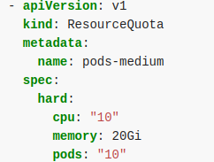

# kubernetics->notes
- we can use sigular /plural or short form command like --
```
kubectl get pod or kubectl get pods or kubectl get po
 ```
 - creating first pod with generator
 ```
 kubectl run pod --generator=run-pod/v1 --image=coolgourav/nginx-custom ---generator wont work deprecated
 kubectl run --image=nginx:alpine myfirstpod -- labels=example=myfirstpod
 ```
 - (kubectl get po -o wide ) for details in which node this pod is running
 ``` 
For yml and json format
 kubectl get po -o yml
 kubectl get po -o json

 ```
 ```
 If we want to get any resource shot form then
 kubectl api-resource | grep -i limit
 Suppose you dont know what is pod then you can learn from it
 kubectl explain pods | less
 kubectl explain pod --recursive | less
 ```
 
 ```
 See what is inside a pod or details about pod
 kubectl describe pod nginx | less
 ```
 ```
 Delete a pod either crashloopback or anything
 kubectl delete pod  myfirstpod
 kubectl delete pods --all
 kubectl edit pod podname
 ```
 ```
 watch pod creating
 kubectl get pod -w
 ```
 
 ```
 General form of cmd
 kubectl actionname resource_type resource_name data
 ex:
 kubectl label pod myfirstpod evn1=lool
 Suppose you want to label all pods
 kubectl label pod --all evn1=lool
 ```
 ```
 kubectl get pods --show-labels
 ```
 
 ```
 Run command inside a pod container
 kubectl exec podname env
 If you have multiple container inside your pod
 kubectl exec podname -c container_name
 
 Then go to your bash of your container
 kubectl exec podname -it bash
 But if you have multiple container
 kubectl exec podname -c container_name -it bash
 ```
 
 
 ```
 set command inside a container
 args:['sleep','50']
 ```
 ```
 How to grep name in pod1.yml
 grep name podname.yml
 ```
 ```
 How to make a contaner to listen to any particular port?
 netcat -l -p 8000
 And how to see how many ports is opend?
 netstat -nltp
 ```
 
 ```
 Suppose we have three pod and if we assign a cluster ip then they can communicate with each other but for out side communication we will need node port.Seeing this bellow pictur will give you a clear idea.
 ```
  
   
 ```
 So we are creating service to communicate between nodes
 kubectl expose pod podname --port=8000 --target-port=80 --name myservice
 Here we check this using 
 kubectl get svc/service/services
 and we will see port an ip
 then 
 curl ip:8000
 ```
 
 ```
 Lets talk about node port assign and accesing from out side world
 kubectl expose pod podname --type=NodePort --port=8000 --target-port=80 --name myservice(not worked in minikube)
 ```
 
 ```
 How service work
 In service yml we have and selector.So if any pod has same label like service selector then the service will devide request to each pod
 lets add label to some pod like this (kubectl label pod myfirstpod evn1=lool)
 and selector like  below picture
 ```
   
 
 ```
 If we run rc then it creates replicas as per template but if same label pod already created then it will not create any pod //but but if existing pods woner is other rc then according to new rc pod will be created
 
 - If we dont put any selector then by default it take template label
 apiVersion: v1
kind: ReplicationController
metadata:
  name: nginx
spec:
  replicas: 3
  selector:
    app: nginx
  template:
    metadata:
      name: nginx
      labels:
        app: nginx
    spec:
      containers:
      - name: nginx
        image: nginx
        ports:
        - containerPort: 80
        if we delete a pods label (app=nginx) then it automaticaly creats immidiatly 
        if we delete a rc its also terminate all its riplicas
        but if we use cascade=false then it only delete rc
 kubectl delete rc --cascade=false  nginx

 ```
 
 ```
 Scalling up and Down is quite easy .We can set number of replica by vi command or
 kubectl scale rc --replical=5 replicaControllerName
 Or siply editing 
 kubectl edit rc name
 ```
 
 ```
 Actualy replicaset are most of the part are equal like replication controller
 But but some extra facilites like we can match labels expression using (In or Not In)
 ```
 
   
 
 ```
 Deployment is very likely to replication with litle change in yml
 it has rollout means new version deploy 
 it has rollback means go back to old version
 it has recreat policy -- in which it make replica=0 of old version and replica=6 of new version
  We can similarly inc or dec the number of replica here also
  Rollout only trigard while we change on its spec only(i mean new version)
  maximumUnavalabe is quite clear that this amount of pod can  be missing
  maximaum surge means this amount of extra pod can be created 
  kubectl rollout history deployment name_of_the_deployment(just work like ctrl+z and ctrl+y----> kubectl rollout undo  deployment name_of_the_deployment)
  
  To go to particular deployment
  kubectl rollout undo --to-revision=2  deployment name_of_the_deployment
  
  To pause a deployment
  kubectl rollout pause deployment name_of_the_deployment
    kubectl rollout resume deployment name_of_the_deployment
  
  
  kubectl apply -f firstdeploy.yml --record (attach the messege auto generated but in yml if we add annotations messege will be set)
  apiVersion: apps/v1
kind: Deployment
metadata:
  name: nginx-deployment
  labels:
    app: nginx
spec:
  replicas: 3
  selector:
    matchLabels:
      app: nginx
  template:
    metadata:
      labels:
        app: nginx
    spec:
      containers:
      - name: nginx
        image: nginx:1.14.2
        ports:
        - containerPort: 80
 ```
 
 ```
 Now we are talking about resource and limit
 *How to check  how much memory a container take ?->docker container stats container_id(and we wil see memeory uses and memory limit)
 But we wand to fixed memory and cpu
 then see the below image while pod creating
 ```
 
 
 ```
 In defaul mood all resource being created on default namespace but there is another namespace pulic where no auth need to access
 Here also we will see(kubectl get pods -n kube-system) a lot of pods which control the master system management
 We can also change default namespace also(kubectl config set-context --current --namespace=test)
 How to check a resource support namespace or not?
 kubectl api-resource | grep -i pod
 kubectl apply -f pod_yml --namespace test (then a pod will be created on test namespace so if we run kubectl get pods
 it will not show any pods)
 To see pods belongs to test namespace
 kubectl get pods -n test
 kubectl get pods --all-namespaces(to see all namespaces pod)
 kubectl delete pod podname -n test(delete a pod from pod namespace)
 ```
 ```
 kubectl create ns myns
 If we want to connect with other namespace service then first enter into that and
 curl servicename.namespacename.svc.cluster.local
 ```
 ```
 Resource qouta is basicaly defining nameapaces resource limit/specification
 like 
 There is two type of quota ->compute qouta(request.cpu) and object qouta(can set number of object like pod:"2")
 if we only set limit but dont set resource then it automaticaly set resource same as limit
 kubectl get resourcequotas -n myns
 kubectl appl -f qouta.yml --namespace=myns
 kubectl describe ns myns(we will see its qouta)
 And take a look on below qouta.yml
 ```
  
 
 
 ```
 We can create limitRange and set to any namespace
 kubectl apply -f firstlimit.yml -n myns
 We can also set limit/resource ratio in yml like below image
 ```
   
 ```
 Config map is decuple the configuration of a pod /It can be ingect not only pof but also other resource
 Config map can be created in sevaral ways 
 
 like(from literal)
 kubectl create configmap special-config --from-literal=special.how=very --from-literal=special.type=charm
 
 Create  configmap from file 
 kubectl create cm cm_name --from-file=filename
 Create configmap from two file 
 kubectl create cm cm_name --from-file=filename --from-file=another_file_name
 Now lets build config map from directory->if we have four file with different keys then running bellow this command will merged all files and its coresponding variables
 kubectl create cm cm_name --from-file=properties/
 ```
 ```
 We can also creat config map from env file 
 
 kubectl create cm cm_name --from-env-file=env.sh 
 here comment will be ignored and alike from file its variable and keypair will be 
 ```
 
 ```
 We can create configmap from yml file 
 apiVersion: v1
kind: ConfigMap
metadata:
  name: game-demo
data:
  # property-like keys; each key maps to a simple value
  player_initial_lives: "3"
  ui_properties_file_name: "user-interface.properties"

  # file-like keys
  game.properties: |
    enemy.types=aliens,monsters
    player.maximum-lives=5    
  user-interface.properties: |
    color.good=purple
    color.bad=yellow
    allow.textmode=true   
    this (game.properties ) are like files
 ```
 
